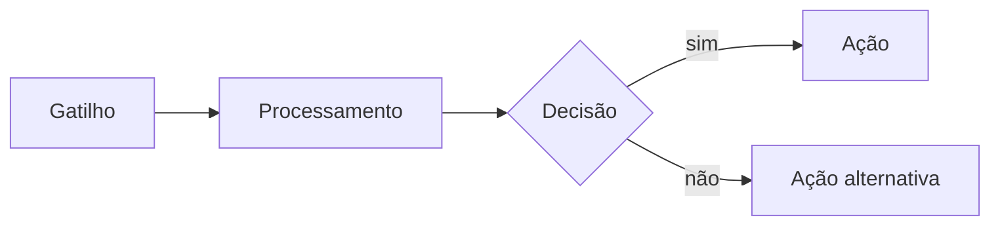

# Template de README de workflow

Copie a estrutura abaixo para cada workflow novo.

---

# NN — Nome do Workflow

**Status:** 🚧 Em construção
**Tempo de construção:** X horas
**Integrações:** lista dos serviços envolvidos

## O problema

Dois ou três parágrafos descrevendo a dor real. Quem sofre com ela, com que frequência,
quanto tempo se perde. Sem jargão. Se possível, com número.

## A solução

Uma frase resumindo o que o fluxo faz, seguida do diagrama.



## Os nós, em ordem

| # | Nó | Tipo | O que faz |
|---|----|------|-----------|
| 1 | Nome descritivo | Webhook | ... |

## Decisões técnicas

- **Por que X e não Y:** ...
- **O que não funcionou:** ...

## Tratamento de erro

O que acontece quando a API de destino está fora, quando o payload vem malformado,
quando o LLM devolve algo inesperado.

## Como testar

Passo a passo para reproduzir, incluindo payload de exemplo.

```json
{ "exemplo": "payload" }
```

## Resultado

O que mudou depois da automação. Tempo economizado, erros evitados, volume processado.

## Próximos passos

O que ficou de fora e melhoraria o fluxo.
