# 01 — Triagem automática de chamados

**Status:** ✅ Rodando
**Tempo de construção:** ~5 h registradas em commits, em 3 sessões (15 a 17/09/2026) — piso; a configuração das contas no Google e no Notion ficou fora desse relógio
**Integrações:** Gmail · OpenAI · Notion · PostgreSQL
**Competências demonstradas:** trigger de e-mail com filtro, LLM com saída estruturada e
schema validado, roteamento condicional por confiança, idempotência com banco, log de
execução, caminhos de erro explícitos

## O problema

Chamados chegam na caixa de suporte como e-mail livre. Alguém precisa abrir cada um, ler,
decidir se é rede, acesso, equipamento ou sistema, estimar a urgência e só então cadastrar
na base do time. É trabalho repetitivo, acontece dezenas de vezes por dia e atrasa
justamente os chamados críticos, que ficam na fila junto com pedidos de troca de mouse.

Em um time de suporte de 3 pessoas recebendo ~40 e-mails por dia, a triagem consome de 40
a 60 minutos diários — mais de 20 horas por mês gastas antes de qualquer chamado começar a
ser resolvido.

## A solução

O fluxo lê a caixa filtrada por label, pede ao LLM uma classificação estruturada, e só
abre o chamado já categorizado quando o próprio modelo declara confiança suficiente —
o resto cai numa visão de revisão humana, nunca é descartado.

```mermaid
flowchart LR
    A[Gmail · novos chamados] --> B[Normalizar campos]
    B --> C[Chamado já processado?]
    C --> D{É chamado novo?}
    D -->|não| Z[Ignorar duplicado]
    D -->|sim| E[Classificar com LLM]
    E --> F[Validar classificação]
    F --> G{Confiança ≥ 0,7?}
    G -->|sim| H[Marcar triagem automática]
    G -->|não| I[Encaminhar para revisão manual]
    E -.erro.-> I
    H --> J[Chamado triado]
    I --> J
    J --> P[Buscar página pelo ID da mensagem]
    P --> Q{Página já existe?}
    Q -->|sim| R[Reaproveitar página existente]
    Q -->|não| S[Retomar dados do chamado]
    S --> K[Criar página no Notion]
    K --> L[Montar registro de log]
    R --> L
    P -.erro.-> M[Registrar falha do Notion]
    K -.erro.-> M
    L --> N[(Registrar no Postgres)]
    M --> N
    N --> O[Marcar e-mail como processado]
```



## Os nós, em ordem

| #  | Nó | Tipo | O que faz |
|----|----|------|-----------|
| 1  | Gmail · novos chamados | Gmail Trigger | Busca a cada minuto por `label:chamados -label:chamado-processado`. O filtro negativo é a primeira barreira contra reprocessamento. |
| 2  | Normalizar campos do chamado | Edit Fields (Set) | Reduz o e-mail a seis campos estáveis: `mensagem_id`, `thread_id`, `remetente`, `assunto`, `corpo`, `recebido_em`. Limpa HTML e corta o corpo em 1900 caracteres. |
| 3  | Chamado já processado? | Postgres (Execute Query) | Conta linhas do log com esse `mensagem_id`, **ignorando** `destino = 'falha-notion'`. |
| 4  | É chamado novo? | IF | Continua só se a contagem for zero. |
| 5  | Ignorar duplicado | No Operation | Fim silencioso para e-mail já triado. |
| 6  | Classificar chamado com LLM | Basic LLM Chain | Envia assunto + corpo e recebe JSON. Tem saída de erro ligada à revisão manual. |
| 6a | Modelo OpenAI | OpenAI Chat Model | `gpt-4o-mini`, `temperature: 0`. |
| 6b | Schema da classificação | Structured Output Parser | Schema JSON com `enum` nas categorias e urgências, e `minimum`/`maximum` na confiança. |
| 7  | Validar classificação | Code | Confere de novo cada campo em JavaScript. Valor fora do esperado vira `Revisão manual` com confiança 0. |
| 8  | Confiança suficiente? | IF | `confianca >= 0.7`. |
| 9  | Marcar triagem automática | Edit Fields (Set) | Carimba `destino: notion` e o motivo. |
| 10 | Encaminhar para revisão manual | Edit Fields (Set) | Recebe os dois caminhos de exceção e preenche `motivo` dizendo qual foi. |
| 11 | Chamado triado | No Operation | Ponto de encontro dos dois caminhos. |
| 12 | Buscar página pelo ID da mensagem | HTTP Request (API do Notion) | Procura no database uma página com o mesmo *ID da mensagem*. Usa a credencial do Notion. 3 tentativas, saída de erro ligada. |
| 13 | Página já existe? | IF | Se achou, uma execução anterior caiu entre criar a página e gravar o log. |
| 14 | Reaproveitar página existente | Edit Fields (Set) | Entrega `id` e `url` da página encontrada, com os mesmos nomes da saída do nó 16. |
| 15 | Retomar dados do chamado | Code | Devolve os dados de *Chamado triado*, que o nó HTTP tinha substituído pela resposta da busca. |
| 16 | Criar página no Notion | Notion (Database Page → Create) | Cria a página no database de chamados. 3 tentativas, saída de erro ligada. |
| 17 | Montar registro de log | Edit Fields (Set) | Monta a linha com os nomes exatos das colunas da tabela. Recebe dos dois caminhos. |
| 18 | Registrar triagem no Postgres | Postgres (Upsert) | Grava em `portfolio.log_triagem`; se já houver linha de falha para o `mensagem_id`, atualiza. |
| 19 | Marcar e-mail como processado | Gmail | Aplica a label `chamado-processado`. |
| 20 | Registrar falha do Notion | Edit Fields (Set) | Caminho de erro da busca e da criação: registra `destino: falha-notion` e **não** marca o e-mail. |

## Decisões técnicas

- **Por que Gmail Trigger e não IMAP:** o nó IMAP lê a caixa, mas não escreve label. Como
  a marcação de "processado" é parte do mecanismo de idempotência, precisava de um nó que
  fizesse as duas pontas na mesma API.

- **Por que filtrar por label na query e não ler tudo e descartar depois:** cada e-mail que
  entra no fluxo custa uma chamada de LLM. Filtrar do lado do Gmail é de graça; filtrar
  depois do nó de classificação seria pago.

- **Por que Basic LLM Chain com Structured Output Parser e não uma chamada HTTP direta:**
  o parser reenvia automaticamente o prompt quando o modelo devolve JSON fora do schema.
  Com HTTP Request eu teria que escrever esse retry na mão.

- **Por que validar de novo no Code se o schema já valida:** o schema garante o *formato*,
  não o *conteúdo* — e ele só age quando o parser está funcionando. O nó Code é o que
  garante que nenhum valor inesperado chegue ao roteamento, inclusive se um dia eu trocar
  o provedor de LLM.

- **Por que um database com propriedade Select e não um database por categoria:** a
  primeira versão deste fluxo usava Trello, onde categoria só existe como lista, então o
  roteamento tinha que resolver um ID de destino diferente para cada categoria — cinco
  variáveis de ambiente e um mapa dentro de uma expressão. No Notion, categoria é uma
  propriedade `Select` de um único database: sobrou uma variável, o mapa sumiu, e o nó de
  roteamento virou um carimbo. Acrescentar uma sexta categoria agora é acrescentar uma
  opção no Select. É a diferença entre o destino ser estrutura e o destino ser dado.

- **Por que o corpo do e-mail vai no conteúdo da página e não numa propriedade:**
  propriedade `rich_text` do Notion tem teto de 2000 caracteres. O corpo é cortado em 1900
  para caber com folga no bloco de texto, e chamado que não se explica em 1900 caracteres
  é chamado que precisa de humano de qualquer jeito.

- **Por que três barreiras de idempotência, e não duas:** o desenho original tinha duas — a
  label do Gmail e o log no Postgres, gravado antes da label. Um teste com erro real mostrou
  a janela que sobrava: a página foi criada no Notion, o log falhou, e o e-mail ficou sem
  label. Com o workflow ativo, o ciclo seguinte criaria uma **segunda página**. A terceira
  barreira pergunta ao destino antes de escrever nele: busca no Notion uma página com o mesmo
  *ID da mensagem* e, se existir, reaproveita. A label é conveniência, o log é o registro, e o
  destino é a última palavra sobre o que já existe.

- **Por que reservar o `mensagem_id` no Postgres não foi a escolha:** gravar uma linha
  `pendente` antes do Notion, protegida pelo `UNIQUE`, é a solução mais forte para várias
  execuções em paralelo. Mas exige decidir o que fazer com linhas que ficaram pendentes depois
  de uma falha, senão o chamado nunca é reprocessado. Com um único n8n lendo a caixa a cada
  minuto, perguntar ao Notion fecha o problema observado com menos regras.

- **Por que HTTP Request e não o nó Notion "Get Many" para a busca:** o Get Many não emite nada
  quando não encontra página, e o "Always Output Data" só cria um item vazio quando **todos**
  os itens vêm vazios. Num lote com dois e-mails, um já com página e outro novo, o novo
  sumiria. O HTTP Request devolve exatamente uma resposta por chamado, com `results` vazio ou
  não.

- **Por que uma falha no Notion não pode contar como "já processado":** a primeira versão da
  checagem contava qualquer linha do log. Uma linha `falha-notion` bloquearia para sempre a
  nova tentativa, e o chamado se perderia em silêncio — o oposto do que o caminho de erro
  promete. A checagem agora ignora essas linhas, e o log virou upsert: a tentativa que dá
  certo sobrescreve a linha da falha.

- **Por que `Revisão manual` é uma categoria e não um e-mail para o analista:** o chamado
  precisa ficar no mesmo lugar onde o time já trabalha, numa visão filtrada do mesmo
  database. Chamado que sai da base vira chamado esquecido.

- **Por que confiança 0,7:** é um chute inicial declarado como chute. A coluna `confianca`
  na tabela de log existe justamente para calibrar esse número depois de uns 50 chamados
  reais, comparando o que o LLM achou com o que o analista de fato fez.

- **Por que os IDs estão no nó e não em variável de ambiente:** o desenho original lia o ID do
  database e o do marcador com `$env`, para não deixar nada específico da conta dentro do nó.
  No n8n 2 isso quebra: o acesso a `$env` é bloqueado por padrão
  (`N8N_BLOCK_ENV_ACCESS_IN_NODE`), e o editor só mostra *not accessible via UI*, o que
  esconde o problema até a execução. Liberar o bloqueio deixaria qualquer expressão ler a
  senha do banco e a chave que criptografa as credenciais. Como nenhum dos dois IDs é
  segredo, eles ficam no nó; o que é segredo continua nas credenciais. Bônus: com o database
  fixo, o editor volta a listar as propriedades do Notion.

## O que não funcionou

Registrado na hora em que aconteceu, não reconstruído de memória. Os três primeiros são
bugs de desenho que passariam despercebidos num teste que só olha se a execução ficou verde.

### No fluxo

- **A falha silenciosa.** No primeiro teste real, o LLM classificou o e-mail do Wi-Fi
  corretamente (`Rede`, `Alta`, confiança `0.9`), e o nó *Validar classificação* transformou
  a resposta em `Revisão manual`, `Baixa`, confiança `0`. O código lia `$json.categoria`, mas
  o Basic LLM Chain com output parser entrega tudo dentro de `$json.output`. Nenhum nó deu
  erro: a validação fez exatamente o que devia com um dado que parecia vazio, e **todo**
  chamado iria para revisão manual. Foi pego só porque o teste comparou a resposta do LLM
  com a saída da validação, e não o status da execução.

- **A janela de duplicidade.** Um teste com erro real deixou a página criada no Notion, sem
  linha no log e sem label no e-mail. Com o workflow ativo, o ciclo seguinte criaria uma
  segunda página: as duas barreiras originais dependiam do log ter sido gravado. Virou a
  terceira barreira — buscar a página pelo *ID da mensagem* antes de criar — e o caso 5 de
  teste.

- **A falha que nunca seria tentada de novo.** O caminho de erro do Notion grava
  `falha-notion` no log e não marca o e-mail, para ele voltar no próximo ciclo. Mas a checagem
  de duplicidade contava qualquer linha do log: o e-mail voltaria, seria considerado
  "já processado", e o chamado se perderia em silêncio. Achado ao desenhar a correção
  anterior, antes de acontecer. A checagem passou a ignorar `falha-notion` e o log virou
  upsert; os dois comportamentos foram provados numa transação desfeita com `ROLLBACK`.

- **Headers do Gmail codificados.** O nó de normalização tinha fallbacks para
  `$json.headers.subject`. A saída real mostrou que os headers vêm brutos, com o assunto
  como `=?UTF-8?Q?Wi=2DFi_do_3=C2=BA_andar_caiu?=`. Se o campo `subject` faltasse, esse texto
  iria parar no Notion. Os fallbacks saíram; ficaram só campos conferidos na saída real.

- **Revisão manual sem os dados do chamado.** A primeira versão montava o item de revisão
  manual aproveitando o que viesse. Funcionava no caminho de confiança baixa e quebrava no
  caminho de erro do LLM, onde o `$json` contém só o objeto de erro. O nó passou a
  reconstruir tudo a partir de `$('Normalizar campos do chamado')`.

### Na plataforma

- **`$env` bloqueado no n8n 2.** O desenho original lia IDs de variáveis de ambiente. O editor
  mostrava só *not accessible via UI*; na execução daria *access to env vars denied*. Confirmado
  lendo o código da versão 2.39.5 instalada. Os IDs, que não são segredo, foram para os nós.

- **O teste que mentiu.** O caso 3 rodado com *Execute step* no último nó passou por todo o
  fluxo com `ja_processado = 0`, como se o log estivesse vazio. Comparando os horários de
  início com a execução anterior, 14 dos 15 nós tinham a saída reaproveitada do cache; só o
  último rodou. Testes de cenário passaram a usar **Execute workflow**.

- **Pin quebra o rastreio de itens.** Fixar a saída do nó do Notion, para não criar páginas
  repetidas durante o teste, fez `$('Chamado triado').item` devolver `null` nos nós seguintes.
  O `NOT NULL` da tabela recusou a linha vazia. Sem pin, todos os campos chegaram.

- **Editor do n8n.** Campo em modo expressão não deixa escolher *From list* (é preciso clicar em
  **Fixed** antes), e o erro de carregar as propriedades do Notion fica em cache até recarregar
  a página, mesmo depois de corrigir o database.

### No ambiente e nas integrações

- **Docker Compose sem `--env-file`.** O comando de recriar o container, como estava na primeira
  versão desta documentação, subiria o n8n com todas as variáveis vazias, inclusive a senha do
  banco: o Compose procura o `.env` na pasta do `docker-compose.yml`, não na raiz. Pego antes
  de rodar.

- **Windows.** O redirecionamento `<` não existe no PowerShell (trocado por `docker cp` +
  `psql -f`); o Docker Desktop instalado por usuário, fora do `Program Files`, some do PATH de
  qualquer app aberto antes da instalação; e o Node derruba o processo com *Assertion failed*
  quando o script chama `process.exit()` logo depois de um `fetch`.

- **Google Cloud.** Publicar o app OAuth em produção — necessário para o acesso ao Gmail não
  expirar em 7 dias — exige página inicial e política de privacidade; o repositório e o
  `PRIVACY.md` cumprem o papel. A URI de retorno do n8n colada em *Origens JavaScript
  autorizadas* é recusada: o lugar certo é *URIs de redirecionamento autorizados*.

- **Notion.** A tela de integrações virou *Developer tools → Connections*, e a integração não
  enxerga nenhuma página até ser conectada nela pelo menu `⋯`.

## Tratamento de erro

| Falha | O que acontece |
|---|---|
| API do LLM fora, timeout ou JSON irrecuperável | 2 tentativas; depois a saída de erro manda para revisão manual com `motivo` preenchido. O e-mail vira chamado do mesmo jeito. |
| LLM devolve categoria fora do `enum` | O nó Code força `Revisão manual` e confiança 0. |
| LLM devolve confiança ausente ou fora de 0–1 | Vira 0, portanto revisão manual. |
| Notion fora do ar (na busca ou na criação) | 3 tentativas com 3s de espera; depois grava `destino: falha-notion` no log e **não** marca o e-mail. A checagem ignora essa linha, então o e-mail é tentado de novo no próximo ciclo. |
| Página criada, mas o log ou a label falham | No ciclo seguinte, a busca pelo *ID da mensagem* acha a página, o fluxo reaproveita e grava o log. Nenhuma página duplicada. |
| Gmail falha ao aplicar a label | A execução continua (`continueRegularOutput`). O registro no Postgres já protege contra duplicata. |
| Mesmo e-mail entra duas vezes | Bloqueado pela checagem no Postgres; se escapar, a busca no Notion reaproveita a página; e a constraint `UNIQUE (mensagem_id)` com upsert impede linha duplicada no log. |

Pendente: apontar um Error Workflow global em **Settings → Error Workflow** para capturar
falhas fora dos caminhos previstos.

## Pré-requisitos

### 1. Tabela de log

Copia o arquivo para dentro do container e executa. São dois comandos em vez de um
redirecionamento `<` porque o PowerShell não tem esse operador — assim funciona igual no
Windows, no Linux e no macOS.

```bash
docker cp workflows/01-triagem-chamados/sql/001-log-triagem.sql n8n-postgres:/tmp/001-log-triagem.sql
```

```bash
docker exec n8n-postgres psql -U n8n -d n8n -f /tmp/001-log-triagem.sql
```

### 2. Labels no Gmail

Crie duas labels: `Chamados` (filtro que joga os e-mails de suporte para lá) e
`Chamado processado`. Depois de importar o workflow, o nó *Marcar e-mail como processado*
deixa escolher a segunda na lista, sem precisar do ID.

### 3. Database no Notion

Um database chamado `Chamados`, com estas propriedades — **os nomes precisam bater exatamente**,
acentos incluídos, porque o nó referencia cada uma por nome:

| Propriedade | Tipo | Opções |
|---|---|---|
| Nome | Title | — |
| Categoria | Select | Acesso · Rede · Equipamento · Sistemas · Revisão manual |
| Urgência | Select | Alta · Média · Baixa |
| Status | Select | Novo · Em andamento · Resolvido |
| Confiança | Number | — |
| Remetente | Text | — |
| Recebido em | Date | — |
| Resumo | Text | — |
| Triagem | Text | — |
| ID da mensagem | Text | — |

Crie também uma visão **Revisão manual**, filtrando `Categoria = Revisão manual` — é a fila
que uma pessoa olha.

O script `scripts/notion-database.mjs` cria esse database com nomes e tipos exatos, e o modo
`--conferir` valida um database existente.

### 4. Escolher os destinos nos nós

O `workflow.json` público traz marcadores `COLE_AQUI_...` no lugar dos IDs da conta. Depois
de importar:

- **Buscar página pelo ID da mensagem** → na *URL*, troque `COLE_AQUI_O_ID_DO_DATABASE_CHAMADOS` pelo ID do database
- **Criar página no Notion** → *Database* → **From list** → `Chamados`
- **Marcar e-mail como processado** → *Label Names or IDs* → `Chamado processado`

### 5. Credenciais no n8n

Gmail (OAuth2), OpenAI (API key), Notion (Internal Integration Token) e Postgres
(host `postgres`, porta `5432`, base `n8n`).

> A integração do Notion não enxerga nada por padrão. Depois de criar o token em
> `notion.so/my-integrations`, abra o database, **… → Connections → Connect to** e escolha a
> integração. Sem isso o nó devolve `object_not_found` mesmo com o ID correto.

## Como testar

Importe `workflow.json` em **Workflows → Import from File**, ligue as credenciais, preencha os
destinos (seção 4 acima) e mande um e-mail para você mesmo com a label `Chamados`.

Rode cada caso com **Execute workflow**. O *Execute step* reaproveita a saída guardada dos nós
anteriores e mostra o resultado de uma execução velha.

**Caso 1 — classificação com alta confiança.** Deve cair em `Rede`, urgência Alta, e virar
página automaticamente.

> **Assunto:** Wi-Fi do 3º andar caiu
> **Corpo:** Pessoal, desde as 9h ninguém do 3º andar consegue conectar no Wi-Fi corporativo.
> Somos uns 12 aqui e o time de vendas está sem acesso ao CRM. No cabo funciona normal.

**Caso 2 — confiança baixa, vai para revisão manual.** Vago demais para decidir entre
Sistemas e Equipamento:

> **Assunto:** não está funcionando
> **Corpo:** oi, aquilo que a gente falou ontem parou de novo. consegue dar uma olhada?

**Caso 3 — idempotência.** Depois do caso 1, remova a label `Chamado processado` do e-mail
e espere o próximo ciclo. O fluxo deve parar em `Ignorar duplicado` e **não** criar uma
segunda página.

**Caso 4 — falha do LLM.** Desligue a credencial da OpenAI e mande um e-mail. Deve virar
chamado em `Revisão manual` com o `motivo` mostrando o erro.

**Caso 5 — página criada, log perdido.** Depois do caso 1, apague a linha do log
(`DELETE FROM portfolio.log_triagem WHERE mensagem_id = '...'`) e tire a label `Chamado
processado` do e-mail. No ciclo seguinte, o fluxo deve seguir por *Reaproveitar página
existente*, gravar o log de novo e **não** criar uma segunda página.

Conferindo o resultado no banco:

```bash
docker exec n8n-postgres psql -U n8n -d n8n -c "SELECT processado_em, categoria, urgencia, confianca, destino, assunto FROM portfolio.log_triagem ORDER BY processado_em DESC LIMIT 20;"
```

Payload que o LLM deve devolver:

```json
{
  "categoria": "Rede",
  "urgencia": "Alta",
  "resumo": "Wi-Fi fora no 3º andar afeta 12 pessoas, time de vendas sem acesso ao CRM.",
  "confianca": 0.93
}
```

## Resultado

Resultado dos testes com e-mails reais, antes de volume de produção:

| Caso | Cenário | Resultado | Tempo |
|---|---|---|---|
| 1 | E-mail claro de rede | Página automática em `Rede`, urgência `Alta`, confiança 0.9 | ~4 s |
| 2 | E-mail vago | IA sugeriu `Sistemas` com confiança 0.6; foi para `Revisão manual` | ~5 s |
| 3 | E-mail já registrado volta sem label | Parou em *Ignorar duplicado*, sem chamar IA nem Notion | ~1 s |
| 4 | IA indisponível | `Revisão manual` com o erro da OpenAI em *Triagem*; nada perdido | ~6 s |
| 5 | Página criada, log perdido | Reaproveitou a página existente; nenhuma duplicata | ~4 s |
| 6 | Workflow **ativo**, e-mail real recebido sem nenhum clique | Gatilho disparou sozinho (`mode: trigger`), classificou como `Acesso` e criou a página | ~6 s após o marcador |

- Uma classificação usou **~920 tokens** do `gpt-4o-mini` (867 de entrada, 50 de saída).
- Com `temperature: 0`, o mesmo e-mail recebeu a mesma resposta, palavra por palavra, em
  execuções diferentes.
- Na triagem manual descrita em *O problema*, cada chamado toma de um a dois minutos de
  leitura e cadastro. Aqui, o caminho completo leva de 4 a 6 segundos, sem ninguém tocar.
- GIF do caso 6, e-mail virando página sem intervenção, em `assets/triagem.mp4`.

Os números de produção — quantos chamados passam direto e quantos vão para revisão — saem
desta consulta, depois de algumas semanas ativo:

```sql
SELECT destino, count(*), round(avg(confianca), 2) AS confianca_media
  FROM portfolio.log_triagem
 GROUP BY destino;
```

## Próximos passos

- [ ] Calibrar o limite de 0,7 com os dados reais da tabela de log.
- [ ] Mostrar o palpite da IA nos chamados em revisão manual. No caso 2, ela sugeriu `Sistemas`
      com confiança 0.6, e a página só diz `Revisão manual` — quem revisa perde uma pista útil.
- [ ] Reforçar no prompt que e-mail vago tem urgência `Baixa` e resumo sem suposições. No caso 2,
      a IA deu urgência `Média` e escreveu "o sistema que foi discutido anteriormente", o que o
      e-mail não diz.
- [ ] Notificar no Slack quando entrar chamado de urgência Alta.
- [ ] Responder o remetente com o link da página, para ele saber que o chamado foi aberto.
- [ ] Error Workflow global.
- [ ] Alertar quando a IA falhar várias vezes seguidas. No caso 4, a execução terminou como
      *success*, porque o erro foi tratado — correto para o fluxo, mas com a OpenAI fora do ar
      por horas todos os chamados iriam para revisão manual sem ninguém ser avisado. O Error
      Workflow não cobre isso, porque para o n8n não houve erro.
- [ ] Usar urgência `Não classificada` quando a IA falhar. Hoje cai no padrão `Baixa`: um
      chamado crítico que chegue durante a queda da IA fica no fim da fila de revisão.
- [ ] Print do fluxo rodando em `assets/`.
