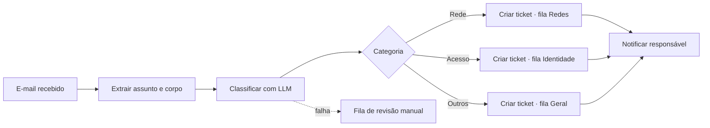

# 01 — Triagem automática de chamados

**Status:** 🔜 Planejado
**Integrações:** IMAP/Gmail · LLM · API do service desk · Slack ou Teams
**Competências demonstradas:** trigger de e-mail, HTTP Request autenticado, roteamento
condicional, uso de LLM com saída estruturada, tratamento de erro

## O problema

Chamados chegam na caixa de suporte como e-mail livre. Alguém precisa abrir cada um, ler,
decidir se é rede, acesso, hardware ou sistema, estimar a urgência e só então cadastrar no
service desk e avisar quem cuida daquilo. É trabalho repetitivo, acontece dezenas de vezes
por dia e atrasa justamente os chamados críticos, que ficam na fila junto com pedidos de
troca de mouse.

## A solução

O fluxo lê a caixa, pede ao LLM uma classificação estruturada, abre o ticket já
categorizado e notifica o time responsável.

## Ponto de atenção

O LLM precisa devolver JSON válido e previsível. O prompt deve fixar o schema
(`categoria`, `urgencia`, `resumo`) e restringir os valores possíveis de cada campo.
Resposta que não passa na validação vai para a fila de revisão manual — nunca é
descartada em silêncio.

## A preencher durante a construção

- [ ] Diagrama final com os nós reais
- [ ] Tabela de nós
- [ ] Decisões técnicas
- [ ] Payload de teste
- [ ] Print do fluxo rodando
