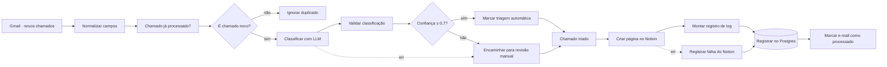

# 01 — Triagem automática de chamados

**Status:** 🚧 Em construção
**Tempo de construção:** a preencher
**Integrações:** Gmail · OpenAI · Notion · PostgreSQL
**Competências demonstradas:** trigger de e-mail com filtro, LLM com saída estruturada e
schema validado, roteamento condicional por confiança, idempotência com banco, log de
execução, caminhos de erro explícitos

## O problema

Chamados chegam na caixa de suporte como e-mail livre. Alguém precisa abrir cada um, ler,
decidir se é rede, acesso, equipamento ou sistema, estimar a urgência e só então cadastrar
na base do time. É trabalho repetitivo, acontece dezenas de vezes por dia e atrasa
justamente os chamados críticos, que ficam na fila junto com pedidos de troca de mouse.

Em um time de suporte de 3 pessoas recebendo ~40 e-mails por dia, a triagem consome de 40
a 60 minutos diários — mais de 20 horas por mês gastas antes de qualquer chamado começar a
ser resolvido.

## A solução

O fluxo lê a caixa filtrada por label, pede ao LLM uma classificação estruturada, e só
abre o chamado já categorizado quando o próprio modelo declara confiança suficiente —
o resto cai numa visão de revisão humana, nunca é descartado.



## Os nós, em ordem

| #  | Nó | Tipo | O que faz |
|----|----|------|-----------|
| 1  | Gmail · novos chamados | Gmail Trigger | Busca a cada minuto por `label:chamados -label:chamado-processado`. O filtro negativo é a primeira barreira contra reprocessamento. |
| 2  | Normalizar campos do chamado | Edit Fields (Set) | Reduz o e-mail a seis campos estáveis: `mensagem_id`, `thread_id`, `remetente`, `assunto`, `corpo`, `recebido_em`. Limpa HTML e corta o corpo em 1900 caracteres. |
| 3  | Chamado já processado? | Postgres (Execute Query) | `SELECT count(*) FROM portfolio.log_triagem WHERE mensagem_id = $1`. |
| 4  | É chamado novo? | IF | Continua só se a contagem for zero. |
| 5  | Ignorar duplicado | No Operation | Fim silencioso para e-mail já triado. |
| 6  | Classificar chamado com LLM | Basic LLM Chain | Envia assunto + corpo e recebe JSON. Tem saída de erro ligada à revisão manual. |
| 6a | Modelo OpenAI | OpenAI Chat Model | `gpt-4o-mini`, `temperature: 0`. |
| 6b | Schema da classificação | Structured Output Parser | Schema JSON com `enum` nas categorias e urgências, e `minimum`/`maximum` na confiança. |
| 7  | Validar classificação | Code | Confere de novo cada campo em JavaScript. Valor fora do esperado vira `Revisão manual` com confiança 0. |
| 8  | Confiança suficiente? | IF | `confianca >= 0.7`. |
| 9  | Marcar triagem automática | Edit Fields (Set) | Carimba `destino: notion` e o motivo. |
| 10 | Encaminhar para revisão manual | Edit Fields (Set) | Recebe os dois caminhos de exceção e preenche `motivo` dizendo qual foi. |
| 11 | Chamado triado | No Operation | Ponto de encontro dos dois caminhos. |
| 12 | Criar página no Notion | Notion (Database Page → Create) | Cria a página no database de chamados. 3 tentativas, saída de erro ligada. |
| 13 | Montar registro de log | Edit Fields (Set) | Monta a linha com os nomes exatos das colunas da tabela. |
| 14 | Registrar triagem no Postgres | Postgres (Insert) | Grava em `portfolio.log_triagem`. |
| 15 | Marcar e-mail como processado | Gmail | Aplica a label `chamado-processado`. |
| 16 | Registrar falha do Notion | Edit Fields (Set) | Caminho de erro do Notion: registra `destino: falha-notion` e **não** marca o e-mail. |

## Decisões técnicas

- **Por que Gmail Trigger e não IMAP:** o nó IMAP lê a caixa, mas não escreve label. Como
  a marcação de "processado" é parte do mecanismo de idempotência, precisava de um nó que
  fizesse as duas pontas na mesma API.

- **Por que filtrar por label na query e não ler tudo e descartar depois:** cada e-mail que
  entra no fluxo custa uma chamada de LLM. Filtrar do lado do Gmail é de graça; filtrar
  depois do nó de classificação seria pago.

- **Por que Basic LLM Chain com Structured Output Parser e não uma chamada HTTP direta:**
  o parser reenvia automaticamente o prompt quando o modelo devolve JSON fora do schema.
  Com HTTP Request eu teria que escrever esse retry na mão.

- **Por que validar de novo no Code se o schema já valida:** o schema garante o *formato*,
  não o *conteúdo* — e ele só age quando o parser está funcionando. O nó Code é o que
  garante que nenhum valor inesperado chegue ao roteamento, inclusive se um dia eu trocar
  o provedor de LLM.

- **Por que um database com propriedade Select e não um database por categoria:** a
  primeira versão deste fluxo usava Trello, onde categoria só existe como lista, então o
  roteamento tinha que resolver um ID de destino diferente para cada categoria — cinco
  variáveis de ambiente e um mapa dentro de uma expressão. No Notion, categoria é uma
  propriedade `Select` de um único database: sobrou uma variável, o mapa sumiu, e o nó de
  roteamento virou um carimbo. Acrescentar uma sexta categoria agora é acrescentar uma
  opção no Select. É a diferença entre o destino ser estrutura e o destino ser dado.

- **Por que o corpo do e-mail vai no conteúdo da página e não numa propriedade:**
  propriedade `rich_text` do Notion tem teto de 2000 caracteres. O corpo é cortado em 1900
  para caber com folga no bloco de texto, e chamado que não se explica em 1900 caracteres
  é chamado que precisa de humano de qualquer jeito.

- **Por que dois mecanismos de idempotência:** a label do Gmail sozinha tem uma janela de
  falha — se a página é criada e a chamada de label falha, o próximo ciclo cria uma segunda
  página. Por isso o log no Postgres é gravado **antes** da label, e `mensagem_id` tem
  constraint `UNIQUE`. A label é conveniência; o banco é a garantia.

- **Por que `Revisão manual` é uma categoria e não um e-mail para o analista:** o chamado
  precisa ficar no mesmo lugar onde o time já trabalha, numa visão filtrada do mesmo
  database. Chamado que sai da base vira chamado esquecido.

- **Por que confiança 0,7:** é um chute inicial declarado como chute. A coluna `confianca`
  na tabela de log existe justamente para calibrar esse número depois de uns 50 chamados
  reais, comparando o que o LLM achou com o que o analista de fato fez.

- **O que não funcionou:** a primeira versão montava o item de revisão manual com
  `includeOtherFields: true`, aproveitando o que viesse. Funcionava no caminho de confiança
  baixa e quebrava no caminho de erro do LLM, onde o `$json` contém só o objeto de erro.
  Os dois caminhos entram no mesmo nó, então ele passou a reconstruir tudo a partir de
  `$('Normalizar campos do chamado')`.

## Tratamento de erro

| Falha | O que acontece |
|---|---|
| API do LLM fora, timeout ou JSON irrecuperável | 2 tentativas; depois a saída de erro manda para revisão manual com `motivo` preenchido. O e-mail vira chamado do mesmo jeito. |
| LLM devolve categoria fora do `enum` | O nó Code força `Revisão manual` e confiança 0. |
| LLM devolve confiança ausente ou fora de 0–1 | Vira 0, portanto revisão manual. |
| Notion fora do ar | 3 tentativas com 3s de espera; depois grava `destino: falha-notion` no log e **não** marca o e-mail — ele volta na próxima execução. |
| Gmail falha ao aplicar a label | A execução continua (`continueRegularOutput`). O registro no Postgres já protege contra duplicata. |
| Mesmo e-mail entra duas vezes | Bloqueado pela consulta de dedupe; se escapar, a constraint `UNIQUE (mensagem_id)` com `skipOnConflict` barra. |

Pendente: apontar um Error Workflow global em **Settings → Error Workflow** para capturar
falhas fora dos caminhos previstos.

## Pré-requisitos

### 1. Tabela de log

Copia o arquivo para dentro do container e executa. São dois comandos em vez de um
redirecionamento `<` porque o PowerShell não tem esse operador — assim funciona igual no
Windows, no Linux e no macOS.

```bash
docker cp workflows/01-triagem-chamados/sql/001-log-triagem.sql n8n-postgres:/tmp/001-log-triagem.sql
```

```bash
docker exec n8n-postgres psql -U n8n -d n8n -f /tmp/001-log-triagem.sql
```

### 2. Labels no Gmail

Crie duas labels: `Chamados` (filtro que joga os e-mails de suporte para lá) e
`Chamado processado`. O ID da segunda vai para o `.env` — ele aparece ao rodar um nó Gmail
com a operação **Label → Get Many**.

### 3. Database no Notion

Um database chamado `Chamados`, com estas propriedades — **os nomes precisam bater exatamente**,
acentos incluídos, porque o nó referencia cada uma por nome:

| Propriedade | Tipo | Opções |
|---|---|---|
| Nome | Title | — |
| Categoria | Select | Acesso · Rede · Equipamento · Sistemas · Revisão manual |
| Urgência | Select | Alta · Média · Baixa |
| Status | Select | Novo · Em andamento · Resolvido |
| Confiança | Number | — |
| Remetente | Text | — |
| Recebido em | Date | — |
| Resumo | Text | — |
| Triagem | Text | — |
| ID da mensagem | Text | — |

Crie também uma visão **Revisão manual**, filtrando `Categoria = Revisão manual` — é a fila
que uma pessoa olha.

O ID do database são os 32 caracteres da URL, entre a barra e o `?v=`.

### 4. Variáveis de ambiente

Preencha no `.env` (veja `.env.example`) e recrie o container para que o n8n enxergue:

```bash
docker compose -f infra/docker-compose.yml up -d --force-recreate n8n
```

### 5. Credenciais no n8n

Gmail (OAuth2), OpenAI (API key), Notion (Internal Integration Token) e Postgres
(host `postgres`, porta `5432`, base `n8n`).

> A integração do Notion não enxerga nada por padrão. Depois de criar o token em
> `notion.so/my-integrations`, abra o database, **… → Connections → Connect to** e escolha a
> integração. Sem isso o nó devolve `object_not_found` mesmo com o ID correto.

## Como testar

Importe `workflow.json` em **Workflows → Import from File**, ligue as quatro credenciais e
mande um e-mail para você mesmo com a label `Chamados`.

**Caso 1 — classificação com alta confiança.** Deve cair em `Rede`, urgência Alta, e virar
página automaticamente.

> **Assunto:** Wi-Fi do 3º andar caiu
> **Corpo:** Pessoal, desde as 9h ninguém do 3º andar consegue conectar no Wi-Fi corporativo.
> Somos uns 12 aqui e o time de vendas está sem acesso ao CRM. No cabo funciona normal.

**Caso 2 — confiança baixa, vai para revisão manual.** Vago demais para decidir entre
Sistemas e Equipamento:

> **Assunto:** não está funcionando
> **Corpo:** oi, aquilo que a gente falou ontem parou de novo. consegue dar uma olhada?

**Caso 3 — idempotência.** Depois do caso 1, remova a label `Chamado processado` do e-mail
e espere o próximo ciclo. O fluxo deve parar em `Ignorar duplicado` e **não** criar uma
segunda página.

**Caso 4 — falha do LLM.** Desligue a credencial da OpenAI e mande um e-mail. Deve virar
chamado em `Revisão manual` com o `motivo` mostrando o erro.

Conferindo o resultado no banco:

```bash
docker exec n8n-postgres psql -U n8n -d n8n -c "SELECT processado_em, categoria, urgencia, confianca, destino, assunto FROM portfolio.log_triagem ORDER BY processado_em DESC LIMIT 20;"
```

Payload que o LLM deve devolver:

```json
{
  "categoria": "Rede",
  "urgencia": "Alta",
  "resumo": "Wi-Fi fora no 3º andar afeta 12 pessoas, time de vendas sem acesso ao CRM.",
  "confianca": 0.93
}
```

## Resultado

A preencher depois de rodar com volume real: número de chamados processados, percentual que
passou direto e percentual que foi para revisão manual, e o tempo de triagem antes e depois.

A consulta de calibração:

```sql
SELECT destino, count(*), round(avg(confianca), 2) AS confianca_media
  FROM portfolio.log_triagem
 GROUP BY destino;
```

## Próximos passos

- [ ] Calibrar o limite de 0,7 com os dados reais da tabela de log.
- [ ] Notificar no Slack quando entrar chamado de urgência Alta.
- [ ] Responder o remetente com o link da página, para ele saber que o chamado foi aberto.
- [ ] Error Workflow global.
- [ ] Print do fluxo rodando em `assets/`.
