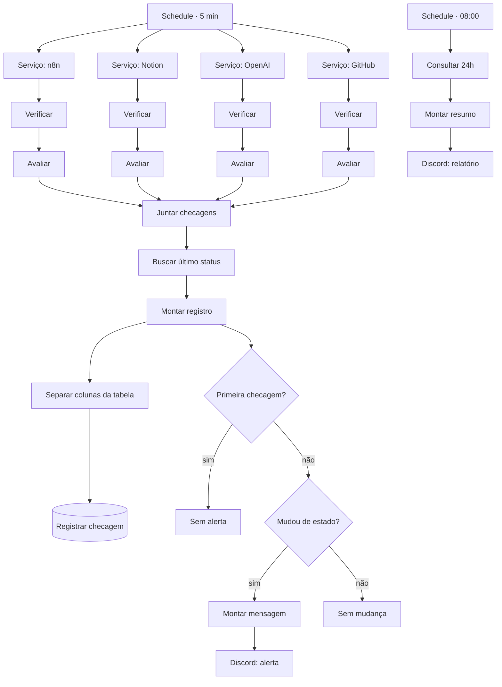

# 02 — Monitor de disponibilidade com relatório diário

**Status:** 🚧 Em construção
**Integrações:** HTTP Request · PostgreSQL · Discord · Notion (API, só para checagem) · OpenAI (API, só para checagem)
**Competências demonstradas:** Schedule Trigger, HTTP Request com tratamento de erro,
comparação de estado via banco, agregação SQL, alerta com controle de ruído

## O problema

Quando um serviço cai, a descoberta costuma vir pelo usuário reclamando. Entre a queda e
o aviso passam minutos ou horas, e ninguém tem histórico para responder à pergunta
"quanto esse serviço ficou fora no mês passado?".

Este workflow monitora exatamente as quatro dependências externas de que o resto deste
portfólio depende: o próprio n8n, a API do Notion (destino do workflow 01), a API da
OpenAI (o LLM do workflow 01) e o GitHub (onde o código vive). Se uma delas cai, o
workflow 01 também para de funcionar direito — só que hoje ninguém fica sabendo até um
chamado ficar preso na fila.

## A solução

Verificação periódica de uma lista de endpoints, alerta imediato na **mudança** de
estado e resumo consolidado no início do dia.



## Ponto de atenção

Alertar a cada verificação enquanto o serviço está fora gera spam e faz o time ignorar o
canal. O alerta dispara só na **transição** de estado — quando um serviço que estava de
pé cai, ou um que estava caído volta —, nunca no estado em si. Um serviço fora por 2
horas gera 24 linhas de log e **1** alerta, não 24.

## Os nós, em ordem

| # | Nó | Tipo | O que faz |
|---|----|------|-----------|
| 1 | Schedule Trigger · a cada 5 min | Schedule Trigger | Dispara sozinho, de 5 em 5 minutos. |
| 2 | Serviço: n8n / Notion / OpenAI / API OpenAI / GitHub | Edit Fields (Set) ×4 | Cada um fixa `servico`, `url` e `started_em` de um serviço. |
| 3 | Verificar n8n / Notion / OpenAI / GitHub | HTTP Request ×4 | Faz a chamada, com `neverError` e timeout de 8s. Cada um tem sua própria autenticação. |
| 4 | Avaliar n8n / Notion / OpenAI / GitHub | Code ×4 | Decide `ok`, calcula `tempo_resposta_ms`, junta com o nó Set correspondente. |
| 5 | Juntar checagens | Merge (append, 4 entradas) | Uma as 4 checagens paralelas numa lista só. |
| 6 | Buscar último status | Postgres (Execute Query) | Pergunta ao banco qual foi o resultado anterior desse serviço. |
| 7 | Montar registro da checagem | Code | Decide `primeira_checagem` e `mudou_estado`. |
| 8 | Separar colunas da tabela | Code | Entrega ao insert só as 6 colunas da tabela. Ramo paralelo ao dos IF. |
| 8b | Registrar checagem | Postgres (Insert) | Grava a linha em `portfolio.disponibilidade_checks`. Fim do ramo. |
| 9 | Primeira checagem? | IF | Sem histórico, não há o que comparar. |
| 10 | Sem alerta (primeira checagem) | No Operation | Fim silencioso, de propósito. |
| 11 | Mudou de estado? | IF | O filtro central do "controle de ruído". |
| 12 | Sem mudança | No Operation | Fim silencioso: estado igual ao anterior. |
| 13 | Montar mensagem de alerta | Edit Fields (Set) | Emoji, título, cor e descrição, prontos para o Discord. |
| 14 | Enviar alerta no Discord | Discord (webhook) | Publica o alerta. |
| 15 | Schedule Trigger · 08:00 diário | Schedule Trigger | Ramo independente, uma vez por dia. |
| 16 | Consultar últimas 24h | Postgres (Execute Query) | Agrega disponibilidade e tempo médio por serviço. |
| 17 | Montar resumo diário | Code | Monta uma mensagem só, com todos os serviços. |
| 18 | Enviar relatório diário | Discord (webhook) | Publica o resumo. |

## Decisões técnicas

- **Por que Schedule Trigger e não webhook:** este workflow não espera nenhum evento
  externo — ele mesmo sai perguntando, de tempos em tempos. É a competência que o
  workflow 01 (reativo, por e-mail) não demonstra.

- **Por que quatro nós HTTP Request separados, e não uma lista percorrida por um nó só:**
  o HTTP Request do n8n não deixa trocar o tipo de autenticação por item — a
  autenticação é uma escolha fixa do nó, não uma expressão. Como dois dos quatro
  serviços (Notion, OpenAI) reaproveitam credenciais já existentes e os outros dois não
  usam nenhuma, cada serviço precisa do seu próprio nó. É uma limitação real do n8n, não
  uma escolha de estilo.

- **Por que `neverError` e `onError: continueRegularOutput` juntos:** são proteções
  diferentes. `neverError` transforma um HTTP 500 numa resposta comum, com o código no
  corpo, em vez de lançar uma exceção. Isso não cobre uma falha de conexão de verdade —
  serviço fora do ar, DNS que não resolve —, que ainda derruba o nó. `onError` cobre esse
  segundo caso. Juntos, nenhuma queda de serviço derruba a execução: ela é exatamente o
  dado que este workflow existe para capturar.

- **Por que gravar toda checagem, e não só as que mudaram:** o relatório diário precisa
  do total de tentativas para calcular percentual de disponibilidade. Gravar só as
  mudanças perderia esse cálculo.

- **Por que reaproveitar as credenciais do Notion e da OpenAI, e não criar credenciais
  novas:** o HTTP Request aceita "Predefined Credential Type", que usa a mesma
  credencial de qualquer outro nó daquele serviço no n8n. Menos um segredo guardado, e
  se o token mudar, muda num lugar só.

- **Por que a checagem do Notion é autenticada, e a do GitHub não:** `users/me` do Notion
  exige token válido — se a integração perder a autorização, aparece aqui como queda,
  que é exatamente o que se quer saber. `api.github.com` sem token só prova que o
  serviço está de pé, o que já basta para esse caso.

- **Por que decidir `primeira_checagem` e `mudou_estado` em código, e não dentro da
  condição dos nós IF:** fica testável fora do n8n (ver `sql/` e os testes descritos
  abaixo) e mais fácil de explicar do que um operador escondido numa expressão booleana.

- **Por que o log e o alerta são ramos paralelos, e não uma linha só:** o insert do Postgres
  tem dois comportamentos que impedem colocar os IF depois dele. Primeiro, ele recusa o item
  inteiro se houver um campo sem coluna correspondente (`primeira_checagem`, `mudou_estado`).
  Segundo, ele devolve a linha gravada (`RETURNING *`), não o item que entrou — os campos da
  decisão sumiriam. Por isso o nó *Montar registro da checagem* abre dois ramos: um separa as
  colunas e grava, o outro decide o alerta com o item completo. O ramo do log fica acima no
  canvas porque o n8n (modo de execução v1) roda os ramos de cima para baixo: o log é gravado
  antes do alerta, e uma falha na gravação para a execução antes de avisar.

- **Por que Discord com autenticação webhook, e não bot:** um webhook não exige servidor
  rodando 24h nem processo de aprovação — é uma URL colada na credencial. Para avisar um
  canal, é suficiente; um bot só valeria a pena se o workflow precisasse ler mensagens de
  volta.

- **Por que a consulta de "último status" usa um SELECT dentro de outro SELECT:** sem
  isso, um serviço checado pela primeira vez devolveria zero linhas, e o n8n descartaria
  o item inteiro em vez de seguir adiante com `ok_anterior = null`. Foi exatamente esse
  erro — "a falha silenciosa" — que apareceu no workflow 01 com uma consulta parecida.
  Aprendida lá, aplicada aqui antes de acontecer de novo.

## O que não funcionou

- **A suposição que não foi conferida.** O desenho original gravava o item completo no Postgres
  com mapeamento automático, supondo que campos sem coluna seriam ignorados. Todo o resto do
  workflow foi conferido no código do n8n antes de escrever o arquivo; esse detalhe não, e
  estava errado: o nó exige que todo campo seja uma coluna. O primeiro teste parou com
  *Column 'ok_anterior' does not exist in selected table*.

- **O erro visível escondia um silencioso.** Ao investigar, apareceu um segundo problema: o
  insert devolve a linha gravada, não o item de entrada. Mesmo que a gravação tivesse
  funcionado, os IF logo depois dela leriam `primeira_checagem` e `mudou_estado` de um
  item sem esses campos, tudo cairia em *Sem mudança*, e o monitor nunca mandaria um alerta
  — com a execução verde. É a mesma classe de falha silenciosa do workflow 01. A correção
  dos dois foi a mesma: tirar os IF de depois do insert (ver *Decisões técnicas*).

## Tratamento de erro

| Falha | O que acontece |
|---|---|
| Um serviço está fora do ar | A checagem grava `ok: false` e o motivo; não derruba as outras três checagens nem a execução. |
| Falha de conexão de verdade (DNS, timeout) | Capturada por `onError: continueRegularOutput`; tratada como "fora do ar", com o erro de rede como motivo. |
| Token do Notion ou da OpenAI expira | A checagem correspondente vira `ok: false`, e o alerta avisa antes de o workflow 01 começar a falhar sem explicação. |
| Discord fora do ar ao enviar o alerta | A checagem já foi gravada no passo anterior; só o aviso se perde. Fica registrado no histórico mesmo assim. |
| O mesmo ciclo de 5 minutos dispara duas vezes | Não gera alerta duplicado: a segunda execução compara com o estado que a primeira acabou de gravar, vê que não mudou, e para em "Sem mudança". |

Pendente: Error Workflow global, como no workflow 01.

## Pré-requisitos

### 1. Tabela de log

```bash
docker cp workflows/02-monitor-disponibilidade/sql/001-disponibilidade-checks.sql n8n-postgres:/tmp/001-disponibilidade-checks.sql
docker exec n8n-postgres psql -U n8n -d n8n -f /tmp/001-disponibilidade-checks.sql
```

### 2. Webhook do Discord

1. No Discord, crie um servidor (ou use um que já tenha) e um canal, por exemplo `#monitor`.
2. Nas configurações do canal → **Integrações** → **Webhooks** → **Novo Webhook**.
3. Copie a **URL do Webhook**.

### 3. Credenciais no n8n

- **Discord Webhook**: cole a URL do passo 2. Não precisa de bot nem de OAuth.
- **Notion** e **OpenAI**: reaproveita as credenciais já criadas no workflow 01
  (`Notion account`, `OpenAI account`). Nada novo a configurar aqui.

## Como testar

Importe `workflow.json`, ligue a credencial do Discord Webhook e as duas reaproveitadas
(Notion e OpenAI) — o n8n pede em cada nó HTTP Request que usa "Predefined Credential
Type".

**Caso 1 — primeira execução.** Rode com **Execute workflow**. Como não há histórico, os
quatro serviços devem passar por *Sem alerta (primeira checagem)*, sem nenhuma mensagem
no Discord. Confira as quatro linhas gravadas:

```bash
docker exec n8n-postgres psql -U n8n -d n8n -c "SELECT servico, ok, status_http, tempo_resposta_ms, verificado_em FROM portfolio.disponibilidade_checks ORDER BY verificado_em DESC LIMIT 4;"
```

**Caso 2 — sem mudança.** Rode de novo. Os quatro serviços devem estar no mesmo estado
de antes; nenhum alerta deve chegar ao Discord.

**Caso 3 — queda simulada.** Troque a URL do nó **Serviço: GitHub** para algo que não
existe, por exemplo `https://api.github.com/rota-que-nao-existe-123`, salve, rode. Deve
chegar um alerta 🔴 no Discord. Rode de novo sem mudar nada: **não** deve chegar um
segundo alerta (mesmo estado). Volte a URL para `https://api.github.com` e rode outra
vez: deve chegar um alerta 🟢 de recuperação. Lembre de desfazer essa alteração depois do
teste.

**Caso 4 — relatório diário.** Abra o nó **Consultar últimas 24h** → **Execute step** e
depois **Montar resumo diário** → **Execute step**. Confira o texto montado antes de
mandar para o Discord.

## Resultado

A preencher depois de rodar em produção por alguns dias: quantas checagens, quantas
quedas reais capturadas, disponibilidade de cada serviço.

## Próximos passos

- [ ] Error Workflow global.
- [ ] Se um serviço ficar indisponível por mais de N minutos seguidos, reenviar o alerta
      (hoje ele avisa uma vez e só avisa de novo quando o serviço volta).
- [ ] Guardar o histórico de mais de 30 dias em outra tabela ou arquivá-lo, para a tabela
      principal não crescer sem limite.
- [ ] GIF do alerta chegando no Discord, em `assets/`.
