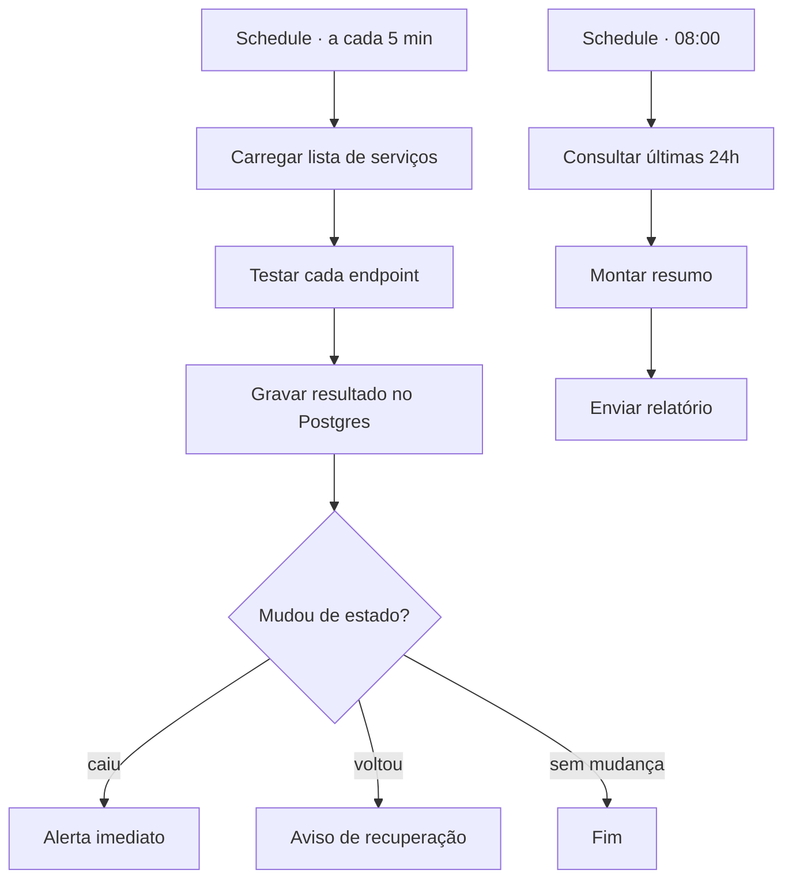

# 02 — Monitor de disponibilidade com relatório diário

**Status:** 🔜 Planejado
**Integrações:** HTTP Request · PostgreSQL · Slack ou Teams · e-mail
**Competências demonstradas:** Schedule Trigger, loop sobre lista, persistência em banco,
agregação de dados, alerta com controle de ruído

## O problema

Quando um serviço cai, a descoberta costuma vir pelo usuário reclamando. Entre a queda e
o aviso passam minutos ou horas, e ninguém tem histórico para responder à pergunta
"quanto esse serviço ficou fora no mês passado?".

## A solução

Verificação periódica de uma lista de endpoints, alerta imediato na mudança de estado e
resumo consolidado no início do dia.

## Ponto de atenção

Alertar a cada verificação enquanto o serviço está fora gera spam e faz o time ignorar o
canal. O alerta deve disparar na **transição** de estado, não no estado. Isso exige
comparar o resultado atual com o último registro no banco.

## A preencher durante a construção

- [ ] Schema da tabela de checks
- [ ] Query de agregação do relatório
- [ ] Decisões técnicas
- [ ] Print do relatório gerado
