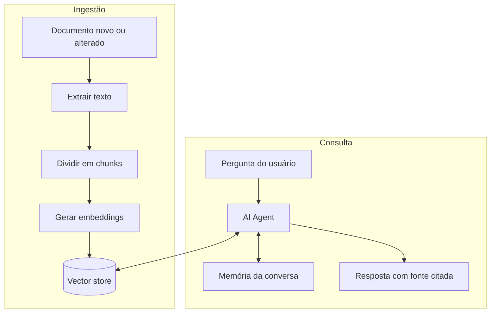

# 03 — Agente de IA sobre base de conhecimento interna

**Status:** 🔜 Planejado
**Integrações:** Google Drive ou pasta local · vector store · LLM · Telegram ou WhatsApp
**Competências demonstradas:** ingestão de documentos, embeddings, RAG, nó de AI Agent,
memória de conversa, integração com mensageria

## O problema

As mesmas perguntas de procedimento interno chegam ao suporte toda semana: como pedir
acesso a tal sistema, qual o prazo de tal processo, quem aprova o quê. A resposta está
documentada, mas ninguém acha o documento — então é mais rápido perguntar para uma pessoa.

## A solução

Dois fluxos: um que ingere e indexa os documentos, outro que responde perguntas
consultando esse índice.

## Ponto de atenção

O agente precisa citar de qual documento tirou a resposta e admitir quando a base não
cobre a pergunta. Agente que inventa procedimento interno é pior que não ter agente —
esse é o ponto que rende a melhor discussão em entrevista.

## A preencher durante a construção

- [ ] Estratégia de chunking e por quê
- [ ] Vector store escolhido e por quê
- [ ] Prompt do agente
- [ ] Casos de teste, incluindo pergunta fora da base
- [ ] GIF de uma conversa real
