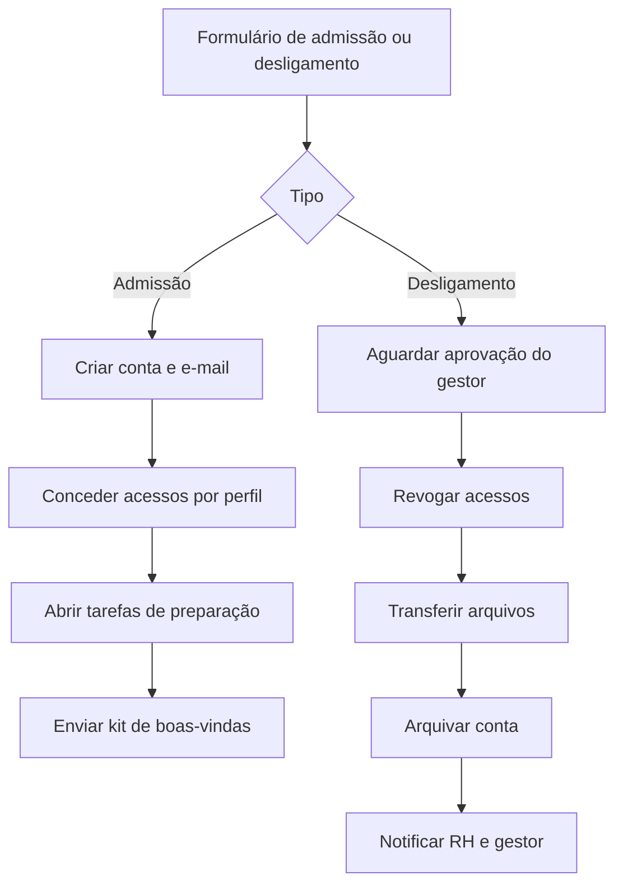

# 04 — Onboarding e offboarding de colaborador

**Status:** 🔜 Planejado
**Integrações:** formulário · Google Workspace ou Entra ID · gestor de tarefas · e-mail
**Competências demonstradas:** orquestração de múltiplas APIs, sub-workflows,
human-in-the-loop, rollback, desenho de processo de negócio

## O problema

A entrada de um colaborador envolve criar conta, e-mail, acessos a sistemas, preparar
equipamento e enviar as informações do primeiro dia — tudo manual, disparado por mensagem
avulsa, e com etapas que se perdem. A saída é pior: acesso revogado com atraso é risco de
segurança real, e frequentemente alguém descobre meses depois que uma conta continuava
ativa.

## A solução

Um formulário dispara o processo completo, com aprovação humana antes das ações
irreversíveis.

## Ponto de atenção

Este é o único fluxo que executa ações destrutivas. Revogação e arquivamento precisam de
aprovação explícita registrada, e o fluxo deve gravar log de cada etapa concluída — para
que uma falha no meio não deixe o processo em estado indefinido, sem ninguém saber o que
já foi feito.

## A preencher durante a construção

- [ ] Matriz de perfil de acesso
- [ ] Desenho do sub-workflow de concessão
- [ ] Estratégia de log e retomada
- [ ] Decisões técnicas
- [ ] Print do fluxo com a etapa de aprovação
