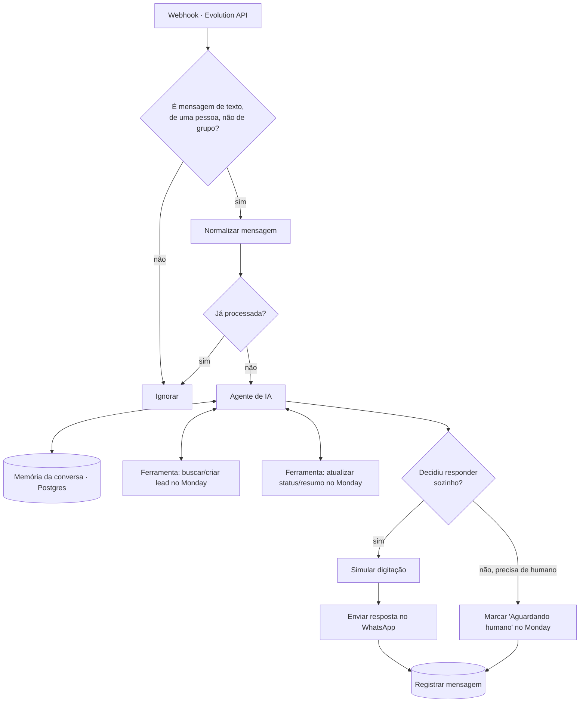

# 05 — Atendimento humanizado no WhatsApp com CRM

**Status:** 🚧 Em construção
**Integrações:** WhatsApp (via Evolution API, self-hosted) · OpenAI · Monday.com · PostgreSQL
**Competências demonstradas:** webhook de canal externo, agente de IA com memória de
conversa e *tool calling*, integração com CRM via API, design de automação com limite
de risco explícito

## O problema

Atendimento inicial por WhatsApp — responder dúvidas simples, entender o que a pessoa
precisa, registrar o contato como lead — hoje é feito por uma pessoa lendo e digitando
cada mensagem, ou nem é feito, e o lead se perde na conversa. Não existe um lugar central
com o histórico de quem entrou em contato, o que perguntou e em que ponto a conversa
parou.

Este workflow é um estudo para uma entrevista: mostra um agente de IA respondendo pelo
WhatsApp com memória de conversa, decidindo quando resolver sozinho e quando chamar um
humano, e mantendo um CRM (Monday.com) atualizado sozinho.

## A solução

Um agente de IA recebe a mensagem, consulta e atualiza o lead no Monday.com como
ferramentas próprias (*tool calling*), responde pelo WhatsApp com uma pausa de digitação
simulada, e só passa para um humano quando decide que não deve responder sozinho.



## Ponto de atenção — leia antes de configurar

**Evolution API não é o WhatsApp oficial.** É um gateway open-source, self-hosted, que
fala o protocolo do WhatsApp Web (via a biblioteca Baileys). Funciona bem e de graça, mas
está fora dos Termos de Uso do WhatsApp — o número conectado corre risco real de
restrição, principalmente com volume alto ou comportamento que pareça automação agressiva
(mensagens não solicitadas, respostas instantâneas demais, envio em massa).

Este workflow foi desenhado para reduzir esse risco, e não só para funcionar:

- **É só reativo.** Nunca inicia conversa — só responde quem manda mensagem primeiro.
- **Ignora grupos.** Só atende conversa individual.
- **Simula digitação antes de responder**, numa pausa proporcional ao tamanho da
  resposta — também é o que torna o atendimento "humanizado" de verdade, não só uma
  frase de efeito.
- **Tem uma saída para humano.** O agente não é obrigado a resolver tudo sozinho; ver
  *Decisões técnicas*.

Ainda assim, é risco real, não risco zero. Por decisão do autor, o número conectado é o
pessoal — ver a decisão sobre isso abaixo.

## Os nós, em ordem

*A preencher durante a construção, conforme os nós forem desenhados e testados —
mesmo formato do workflow 01/02.*

## Decisões técnicas

- **Por que Evolution API, e não a API oficial do WhatsApp (Meta Cloud API):** a API
  oficial tem uma camada gratuita real (conversas de serviço dentro de uma cota mensal),
  mas exige conta de desenvolvedor Meta, aprovação de app e, para produção, verificação
  de negócio — fricção alta para um projeto de estudo com prazo curto. A Evolution API
  sobe em minutos, no mesmo Docker Compose que já existe neste repositório.

- **Por que o número conectado é o pessoal do autor, e não um número reserva:** decisão
  explícita, sabendo do risco de restrição do WhatsApp — não havia um número separado
  disponível no momento. Mitigado com as quatro proteções listadas acima em *Ponto de
  atenção*: sem iniciar conversa, sem grupo, com pausa de digitação, e teto de decisão
  onde o agente para e chama um humano.

- **Por que Monday.com como CRM, e não uma tabela no Postgres:** o Postgres já guarda o
  histórico técnico (idempotência, auditoria). O CRM precisa ser o lugar onde uma pessoa
  — não um desenvolvedor — acompanha os leads sem abrir um banco de dados. Board criado
  por script (`scripts/monday-board.mjs`), no mesmo espírito do
  `workflows/01-triagem-chamados/scripts/notion-database.mjs`: colunas com ID fixo,
  conferíveis, sem depender de digitar oito nomes certos na interface.

- **Por que memória de conversa em vez de reprocessar o histórico a cada mensagem:** sem
  memória, o agente trataria cada mensagem como uma conversa nova — perderia contexto de
  "aquilo que você falou há dois minutos". A memória é indexada pelo número de WhatsApp
  (`wa_id`), então cada contato tem a própria linha do tempo.

- **Por que *tool calling* para o Monday, e não um nó fixo depois da resposta da IA:** o
  agente decide sozinho quando vale a pena consultar ou atualizar o lead — por exemplo,
  não teria por que gravar o CRM a cada "oi" trocado, só quando algo relevante muda. Um
  nó fixo gravaria sempre, mesmo sem necessidade.

## Tratamento de erro

*A preencher durante a construção.*

## Pré-requisitos

### 1. Subir a Evolution API

Já está no `infra/docker-compose.yml`. Gere a chave e suba o serviço:

```bash
openssl rand -hex 24
```

Cole o resultado em `EVOLUTION_API_KEY` no `.env`, depois:

```bash
docker compose -f infra/docker-compose.yml --env-file .env up -d evolution
```

### 2. Tabela de log

```bash
docker cp workflows/05-atendimento-whatsapp-crm/sql/001-atendimento-mensagens.sql n8n-postgres:/tmp/001-atendimento-mensagens.sql
docker exec n8n-postgres psql -U n8n -d n8n -f /tmp/001-atendimento-mensagens.sql
```

### 3. Board no Monday.com

```bash
node workflows/05-atendimento-whatsapp-crm/scripts/monday-board.mjs
node workflows/05-atendimento-whatsapp-crm/scripts/monday-board.mjs --conferir
```

### 4. Credenciais no n8n

OpenAI (já existe, do workflow 01), Postgres (já existe), Monday.com API (token do
`.env`), e a chave da Evolution API usada nos nós HTTP Request.

## Como testar

*A preencher durante a construção.*

## Resultado

*A preencher.*

## Próximos passos

- [ ] Desenhar e testar o workflow completo no n8n.
- [ ] Definir a persona/tom do agente (nome, escopo do que ele pode e não pode responder).
- [ ] Considerar um número de WhatsApp dedicado, separado do pessoal, se o projeto
      crescer além do estudo para entrevista.
- [ ] Migrar para a API oficial da Meta se este atendimento algum dia for para produção
      de verdade — a Evolution API é para estudo e demonstração, não para depender dela
      num negócio real.
